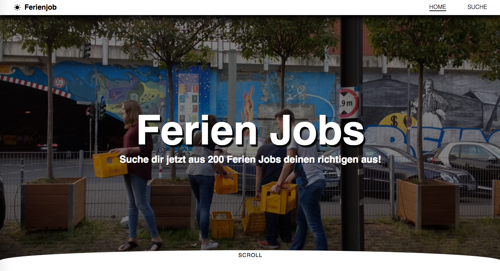
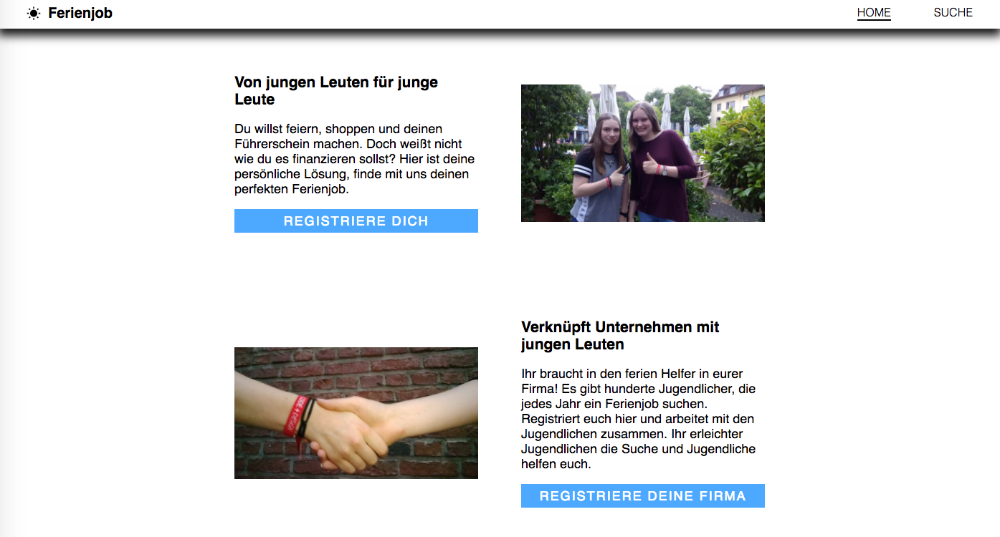
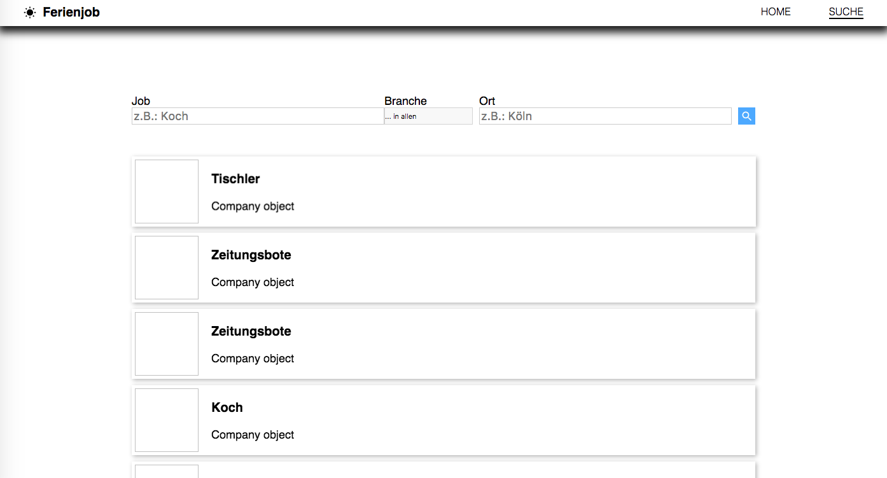
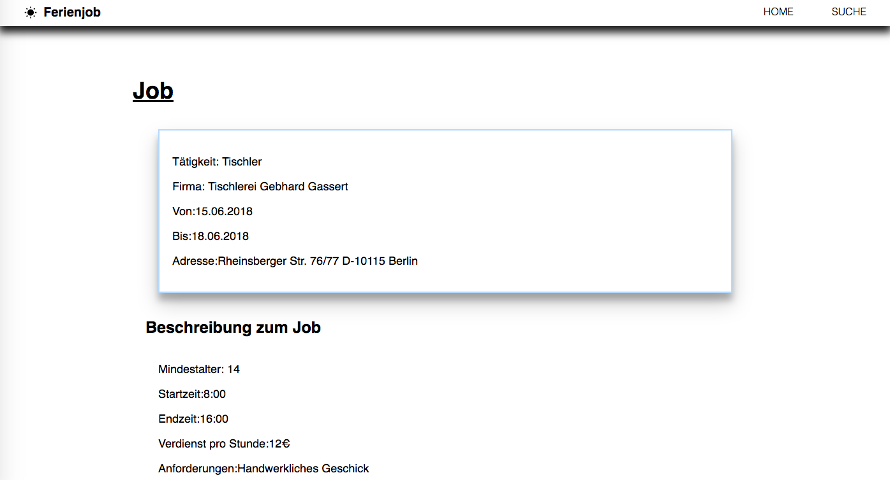

# frontend

Die Website von Ferienjob projekt.

## Farben

- button: `#4da9ff`
- hintergrund von card `#b3d9ff`
- impressum `#0084ff`

## Seiten

- page structure (navbar, footer, ...) `Johannes`

- landing page/startseite `Johanna`
- suche `TODO: Johannes`
- jobanzeige `?`
- profil vom arbeitnehmer `luca`
- profile vom arbeitgeber `lena`

- impressum `?`
- login/signup `Johanna`

## Anderes

- logo `Johanna`
